# Savoury Heaven - Restaurant Reservation System

## Live Demo & Repository

- **Live Application**: [View Live Site](https://savouryheaven-15fa27504aa2.herokuapp.com/)
- **GitHub Repository**: [View Source Code](https://github.com/PaulD95-git/savouryheaven)

---

## Table of Contents
- [Project Overview](#project-overview)
- [Project Rationale](#project-rationale)
- [UX Design Process](#ux-design-process)
- [Database Schema](#database-schema)
- [Agile Methodology](#agile-methodology)
- [Features](#features)
- [Technologies Used](#technologies-used)
- [Testing](#testing)
- [Deployment](#deployment)
- [Security Features](#security-features)
- [Bugs and Solutions](#bugs-and-solutions)
- [Future Enhancements](#future-enhancements)
- [Acknowledgements](#acknowledgements)

---

## Project Overview

Savoury Heaven is a sophisticated full-stack restaurant website featuring an online booking system and digital menu. Built with Django and PostgreSQL, the platform provides customers with an elegant way to explore culinary offerings, make reservations, and manage their bookings seamlessly. The application demonstrates full CRUD (Create, Read, Update, Delete) functionality with role-based access control for both customers and administrators.

**Target Audience**: Restaurant customers seeking convenient online reservation management and restaurant staff requiring efficient booking administration.

---

## Project Rationale

### Business Need
Traditional restaurant reservation systems often rely on phone calls, leading to:
- Missed bookings during busy hours or off-hours
- Double bookings and scheduling conflicts
- Limited customer self-service options
- Time-consuming manual management for staff

### Solution
Savoury Heaven addresses these pain points by providing:
- **24/7 Online Booking**: Customers can book tables anytime without phone calls
- **Real-Time Availability**: Instant feedback on available time slots prevents double bookings
- **Customer Empowerment**: Users can view, edit, and cancel their own reservations
- **Admin Efficiency**: Centralized dashboard for staff to manage all bookings and users
- **Digital Menu**: Showcases offerings to attract customers before they book

### Real-World Application
This system serves fine dining establishments needing:
- Professional online presence
- Automated reservation management
- Customer relationship tracking
- Reduced administrative overhead

---

## UX Design Process

### Design Philosophy
The design prioritizes **elegance**, **simplicity**, and **accessibility** to reflect the fine dining experience while ensuring ease of use across all devices.

### User-Centered Design Approach

#### User Research
**Primary User Groups Identified**:
1. **Diners**: Need quick, intuitive booking with minimal steps
2. **Restaurant Staff**: Require comprehensive booking oversight and management tools
3. **Mobile Users**: Often book on-the-go and need responsive design

#### Design Principles Applied
1. **Clarity Over Cleverness**: Every action has clear labels and immediate feedback
2. **Mobile-First Approach**: Designed for smallest screens first, then scaled up
3. **Consistency**: Uniform navigation, color scheme, and interaction patterns throughout
4. **Accessibility**: WCAG 2.1 AA compliance for color contrast and semantic markup

### Wireframes & Mockups

#### Booking Flow Wireframe
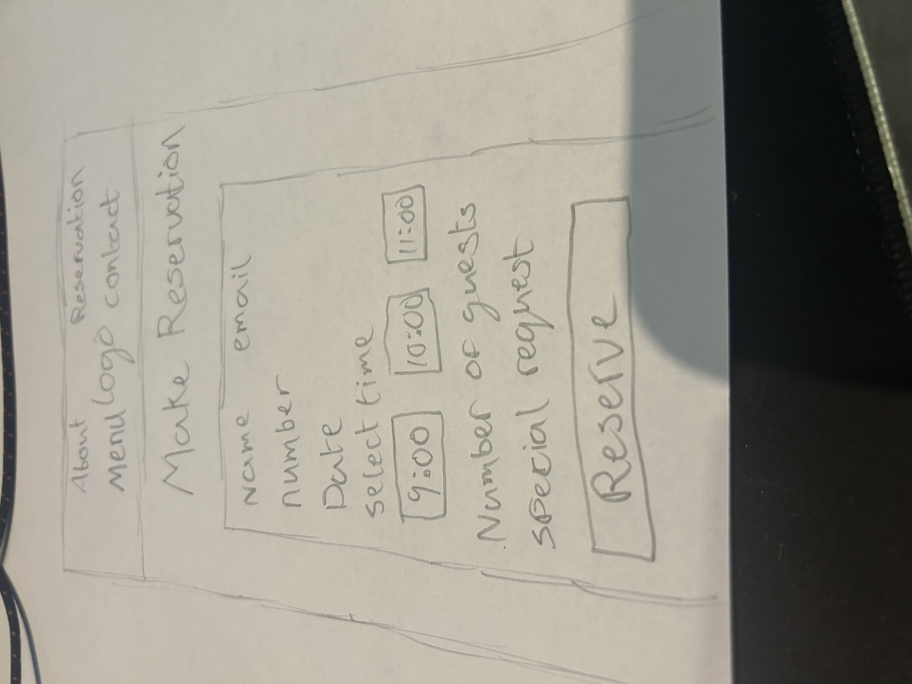
*Initial hand-drawn wireframe showing booking form layout and user flow*

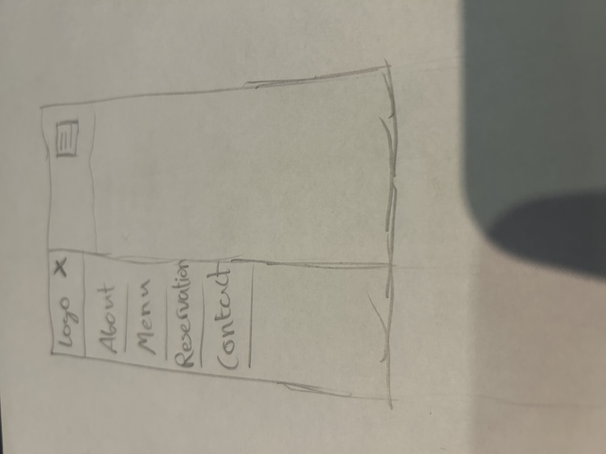  
*Hand-drawn responsive navigation concepts showing mobile and desktop layouts*

### Design Process Documentation

**Hand-Drawn Wireframes Rationale**:
- **Low-Fidelity Start**: Began with pencil and paper to quickly iterate on layout concepts without technical constraints
- **User Flow Focus**: Concentrated on intuitive navigation paths before visual design
- **Responsive Planning**: Sketched multiple device sizes to ensure mobile-first approach
- **Rapid Iteration**: Easy to modify and test different layout options before implementation

**From Sketch to Implementation**: These initial concepts evolved into the final responsive design while maintaining the core user experience principles established in the wireframes.

### Color Scheme & Typography

**Color Palette** (CSS Variables):
```css
--gold: #d4af37           /* Primary accent color */
--burgundy: #4b1e2f       /* Primary brand color */
--burgundy-light: #633244 /* Secondary brand color */
--cream: #fef6e4          /* Text and highlight color */
```

**Design Rationale**:
- **Deep Burgundy (#4b1e2f)**: Evokes luxury, elegance, and fine dining sophistication
- **Gold (#d4af37)**: Highlights call-to-actions and important navigation elements
- **Cream (#fef6e4)**: Provides excellent contrast for text readability on dark backgrounds
- **Gradient Background**: Creates depth and visual interest without overwhelming content

**Typography**:
- **Headings**: Playfair Display (Google Fonts) - Elegant serif for sophisticated feel
- **Decorative**: Cinzel (Google Fonts) - Alternative serif for special headings
- **Body Text**: Cormorant Garamond (Google Fonts) - Readable serif that maintains elegance
- **Rationale**: All serif typography maintains consistency with fine dining aesthetic while ensuring readability across devices

### Layout & Navigation

**Navigation Structure**:
```
Home
├── About
├── Menu
├── Reservations (My Reservations when logged in)
├── Contact
└── Login/Signup or Logout (positioned in top-right corner)
```

**Desktop Navigation** (1100px+):
- **Centered Logo**: Large brand logo (180px × 280px) centered in navbar
- **Split Navigation**: Links positioned on left and right sides of logo
- **Fixed Positioning**: Auth buttons positioned absolutely in top-right corner
- **Scroll Effect**: Navbar shrinks on scroll (logo reduces to 95px height), burgundy background intensifies

**Mobile Navigation** (<1100px):
- **Offcanvas Sidebar**: Slides in from left (75% width, max 320px)
- **Animated Trigger**: Food burger icon with hover and expansion animations
- **Stacked Layout**: All navigation links + auth buttons in single column
- **Smart Backdrop**: Gradient backdrop (transparent near burger, dark on left) keeps burger visible

**Rationale**: 
- Centered logo creates elegant focal point appropriate for fine dining
- Split navigation maintains balance and visual symmetry
- Custom 1100px breakpoint prevents logo cramping on tablets
- Animated burger adds playful element while remaining functional

### Responsive Breakpoints
- **Desktop**: 1100px+ (Full split navigation with centered logo)
- **Tablet/Small Desktop**: 768px - 1099px (Burger menu, auth buttons in stacked layout)
- **Mobile**: 576px - 767px (Reduced logo size, compact burger button)
- **Small Mobile**: 320px - 575px (Minimum viable layout, smallest logo and menu)

**Critical Design Decision - Custom 1100px Breakpoint**:
- **Standard Bootstrap**: Uses 992px (lg) breakpoint
- **Our Choice**: 1100px custom breakpoint
- **Rationale**: Large centered logo (280px width) + navigation links on both sides require more horizontal space. Testing showed logo and nav items cramped below 1100px, degrading user experience.
- **Implementation**:
```css
@media (max-width: 1100px) {
    .navbar-toggler { display: block; }
    .navbar-nav-left, .navbar-nav-right { display: none !important; }
}
```

### Unique Design Features

**1. Animated Food Burger Menu Icon**
- **Innovation**: Custom-designed hamburger menu styled as a literal burger (bun-patty-bun) with animated "eyes"
- **States**:
  - **Default**: Gold gradient buns, brown patty with drop shadows
  - **Hover**: Burger "wiggles", eyes appear and blink
  - **Active/Expanded**: Buns rotate outward, patty pulses, glowing red eyes pop out dramatically
- **Technical Implementation**: Pure CSS with complex keyframe animations
- **Purpose**: Creates memorable, delightful interaction that aligns with restaurant theme while remaining fully functional

**2. Dynamic Time Slot Availability System**
- **Real-time Updates**: JavaScript fetches available slots via AJAX when date selected
- **Visual Feedback**: 
  - Available slots: Clickable buttons with hover effects
  - Full slots: Disabled with "Fully Booked" indicator
  - Past times: Automatically hidden using client-side date validation
- **Capacity Management**: Backend calculates remaining spots per timeslot
- **User Experience**: Instant feedback prevents booking conflicts before form submission

### User Feedback Mechanisms
- **Success Messages**: Green banners for successful actions (bookings, updates)
- **Error Messages**: Red banners with clear error descriptions
- **Loading States**: Visual indicators during data processing
- **Confirmation Dialogs**: Prevent accidental deletions/cancellations

### Design Decisions Justification

**Decision**: Use date picker instead of manual date entry  
**Rationale**: Reduces user input errors, ensures consistent date formatting, improves mobile UX

**Decision**: Display time slots as buttons rather than dropdown  
**Rationale**: Visual representation of available/unavailable times is more intuitive, reduces cognitive load

**Decision**: Require login for reservations  
**Rationale**: Enables reservation management, prevents anonymous bookings, builds customer database

---

## Database Schema

### Entity Relationship Diagram

```
┌─────────────────┐         ┌─────────────────┐         ┌─────────────────┐
│     User        │         │  Reservation    │         │    TimeSlot     │
├─────────────────┤         ├─────────────────┤         ├─────────────────┤
│ id (PK)         │◄───────┤│ id (PK)         │├───────►│ id (PK)         │
│ username        │    1   ││ user_id (FK)    │    N   │ start_time      │
│ email           │        ││ time_slot_id(FK)│        │ display_name    │
│ password        │        ││ date            │        │ is_active       │
│ date_joined     │        ││ guests          │        │ max_capacity    │
└─────────────────┘        ││ name            │        └─────────────────┘
                           ││ email           │
                           ││ phone           │
                           ││ special_requests│
        ┌──────────────────┤│ is_cancelled    │
        │                  ││ created_at      │
        │                  ││ updated_at      │
        │                  └─────────────────┘
        │
        │       ┌─────────────────┐
        │       │   MenuItem      │
        │       ├─────────────────┤
        │       │ id (PK)         │
        │       │ name            │
        │       │ description     │
        │       │ price           │
        │       │ category        │
        │       │ is_available    │
        │       └─────────────────┘
        │
        └───► (Admin extends User model)
```

### Data Models Overview

| Model | Purpose | Key Fields | Relationships |
|-------|---------|------------|---------------|
| **User** | Django's built-in user authentication | username, email, password, date_joined | One-to-Many with Reservation |
| **Reservation** | Stores customer booking information | date, guests, name, email, phone, special_requests, is_cancelled | Many-to-One with User, Many-to-One with TimeSlot |
| **TimeSlot** | Defines available booking time slots | start_time, display_name, max_capacity, is_active | One-to-Many with Reservation |
| **MenuItem** | Restaurant menu items | name, description, price, category, is_available | Standalone (no direct relationships) |

### Key Relationships

**One User → Many Reservations**
- Each user can create multiple reservations
- Foreign Key: `Reservation.user_id` references `User.id`
- Cascade deletion: If user is deleted, their reservations are marked as orphaned (not deleted)

**One TimeSlot → Many Reservations**
- Each time slot can accommodate multiple reservations (up to max_capacity)
- Foreign Key: `Reservation.time_slot_id` references `TimeSlot.id`
- Business logic prevents overbooking by checking total guests against max_capacity

### Data Validation Rules

**Reservation Model**:
- `date`: Must be present or future date (past dates rejected)
- `guests`: Integer between 1-10 (validated on form submission)
- `email`: Must be valid email format
- `phone`: Optional, validated format if provided
- `is_cancelled`: Boolean default False

**TimeSlot Model**:
- `start_time`: Time format (HH:MM)
- `max_capacity`: Positive integer (typically 40-50 guests)
- `is_active`: Boolean to enable/disable time slots

### Database Configuration

**Development**: SQLite (file-based database)
**Production**: PostgreSQL (Heroku Postgres addon)

Configuration is centralized in `settings.py`:
```python
DATABASES = {
    'default': dj_database_url.config(
        default=os.environ.get('DATABASE_URL'),
        conn_max_age=600
    )
}
```

This allows seamless switching between development and production databases via environment variables.

---

## Agile Methodology

### Project Management Tool
**GitHub Projects** was used for Agile project management, tracking all user stories, tasks, and sprints.

### Agile Process

#### Epic → User Story → Task Breakdown

**Example Epic**: Reservation Management

**User Stories Derived**:
1. As a **customer**, I want to **book a table online** so that **I don't have to call the restaurant**
2. As a **customer**, I want to **view my reservations** so that **I can keep track of my bookings**
3. As a **customer**, I want to **edit my reservation** so that **I can change details if plans change**
4. As a **customer**, I want to **cancel my reservation** so that **I can free up the table if I can't attend**

**Tasks for User Story #1** (Book a table):
- [ ] Create reservation model with required fields
- [ ] Build booking form template with date/time pickers
- [ ] Implement availability checking logic
- [ ] Add form validation
- [ ] Create success confirmation page
- [ ] Write unit tests for booking creation

### User Story Prioritization (MoSCoW Method)

**Must Have** (60% of story points):
- User registration and authentication
- Create reservation
- View reservations
- Admin dashboard

**Should Have** (20% of story points):
- Edit reservation
- Cancel reservation
- Digital menu display

**Could Have** (15% of story points):
- Email confirmations
- Advanced filtering in admin panel

**Won't Have This Time** (5% of story points):
- SMS notifications
- Table seating diagrams
- Payment processing

### User Acceptance Criteria

**Example for "Book a Table" User Story**:

**Given** I am a logged-in customer  
**When** I complete the booking form with valid details  
**Then** I should see a confirmation message  
**And** the reservation should appear in "My Reservations"  
**And** the time slot capacity should be updated  

### Sprint Planning

**Sprint Duration**: 2 weeks per sprint

**Sprint 1** (Setup & Core Features):
- Django project setup
- User authentication
- Basic reservation model
- Simple booking form

**Sprint 2** (CRUD Operations):
- View reservations page
- Edit reservation functionality
- Cancel reservation functionality
- Admin dashboard initial setup

**Sprint 3** (Enhancement & Polish):
- Digital menu integration
- Responsive design refinement
- Testing and bug fixes
- Documentation

### Commit Strategy

**Commit Message Convention**:
```
<type>: <subject>

<body>

Examples:
feat: Add reservation cancellation functionality
fix: Resolve time slot availability calculation bug
docs: Update README with testing documentation
style: Improve mobile responsiveness for booking form
```

**Commit Frequency**: Small, focused commits after each feature/fix (typically 3-5 commits per day during active development)

---

## Features

### 1. **Seamless Table Booking**
   - **Intuitive Interface**: Browse available time slots with a dynamic, user-friendly calendar and time selector. The system instantly updates available slots based on the restaurant's capacity and existing bookings.
   - **Flexible Booking Options**: Specify the number of guests (1-10), choose your preferred date and time, and add any special requests or dietary requirements (e.g., high chair, allergies) to ensure the restaurant is prepared for your visit.
   - **Instant Confirmation**: Receive immediate on-screen confirmation with a summary of your reservation details upon successful booking.

   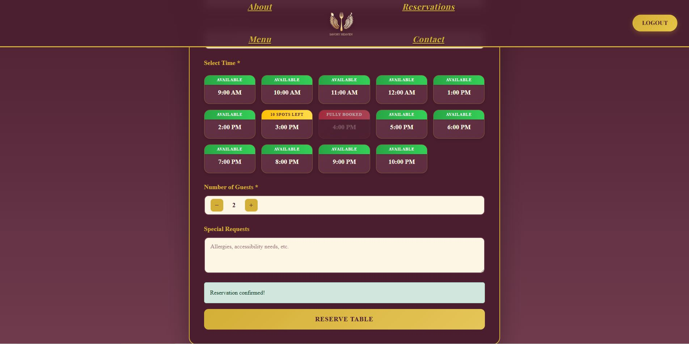
   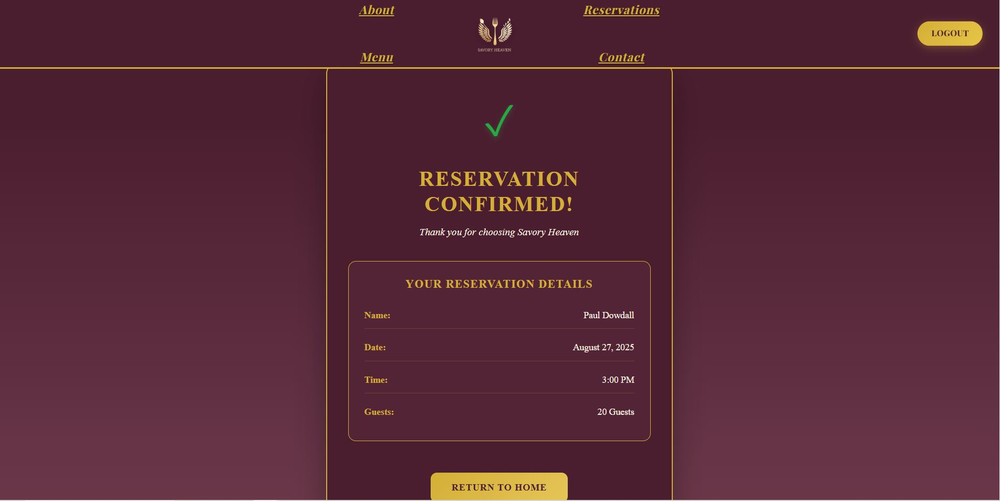

### 2. **Manage Reservations (Cancel/Edit)**
   - **User Control**: Users have a dedicated dashboard to view all their upcoming and past reservations. This provides a single, convenient location to manage all booking-related activities.
   - **Easy Modifications**: Need to change the time, date, or number of guests? The edit feature allows users to update their reservation details effortlessly, subject to availability.
   - **Hassle-Free Cancellations**: Cancel reservations with a single click. A confirmation dialog prevents accidental cancellations.

   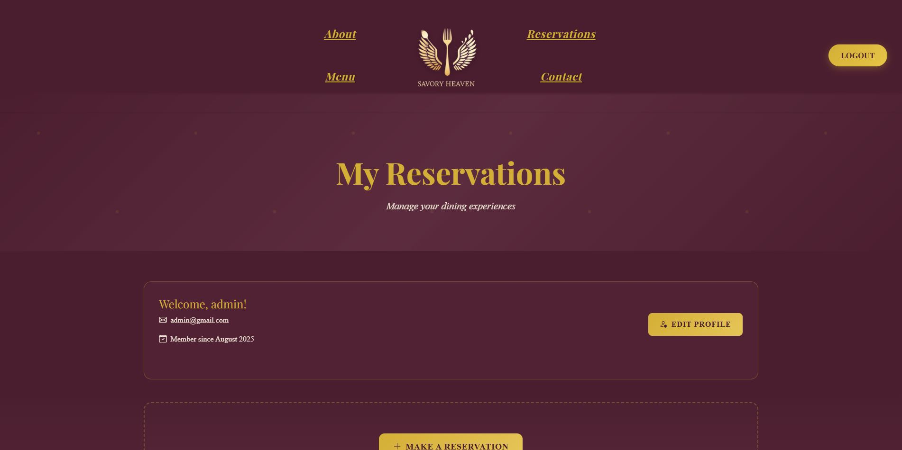
   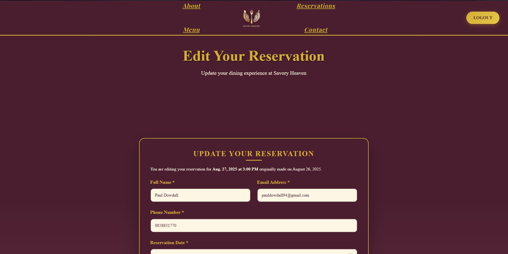
   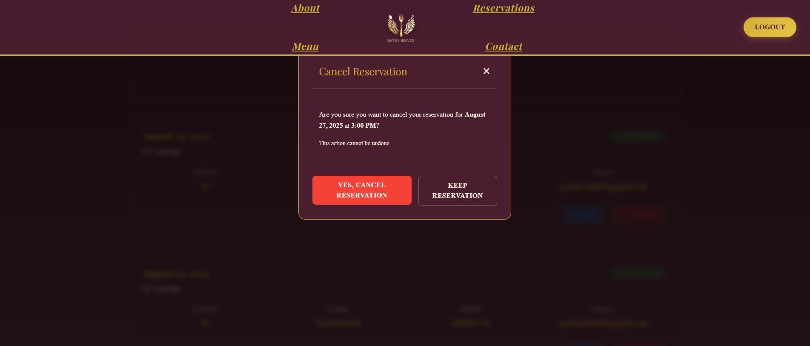

### 3. **Secure User Authentication (Login)**
   - **Protected Accounts**: Users can securely log in to their personal accounts using encrypted credentials, ensuring their personal data and reservation history remain private.
   - **Session Management**: Users remain logged in across pages with Django's built-in session framework.

   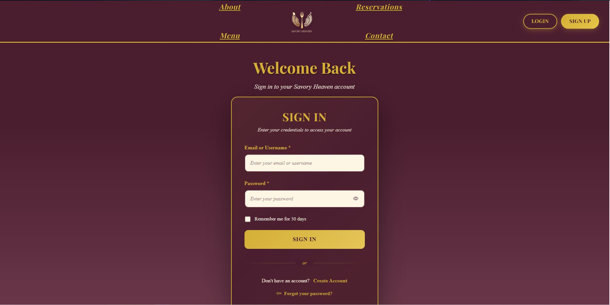

### 4. **Easy Account Creation (Signup)**
   - **Quick Registration**: New users can create an account in moments by providing username, email, and password. This process is designed for maximum efficiency with minimal steps.
   - **Validation**: Form validation ensures strong passwords and unique usernames/emails.

   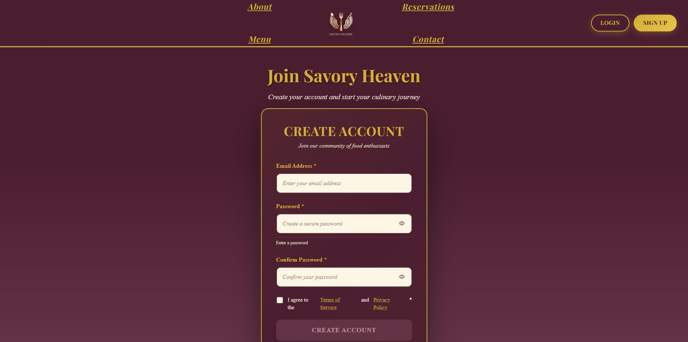

### 5. **Comprehensive Admin Dashboard**
   - **Centralized Management**: Admins have access to a powerful Django admin dashboard that serves as the command center for all restaurant operations.
   - **View All Reservations**: Get a complete, real-time overview of all bookings, filtered by date, to easily manage daily covers and plan seating arrangements.
   - **Manage Users**: Administrators can view, edit, or deactivate user accounts, maintaining the platform's integrity and user base.
   - **Manage Menu Items**: Add, edit, or remove menu items without writing code.

   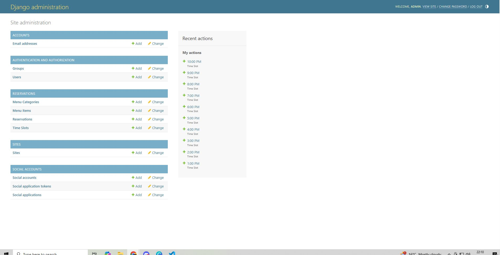

### 6. **Fully Responsive Design**
   - **Accessibility on Any Device**: The application is built with a mobile-first approach, ensuring a flawless and consistent user experience whether accessed from a desktop (1024px+), tablet (768px-1023px), or smartphone (320px-767px). Customers can book a table on the go with ease.

   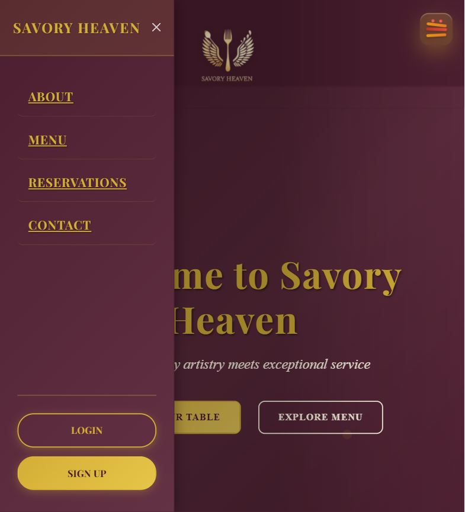

### 7. **Digital Menu**
   - **Discover Offerings**: A beautifully presented digital menu allows users to browse the restaurant's culinary offerings, including categories, descriptions, and prices, helping them decide to book a table.
   - **Admin-Controlled**: Staff can add, edit, or remove menu items through the admin panel without needing to write code.

   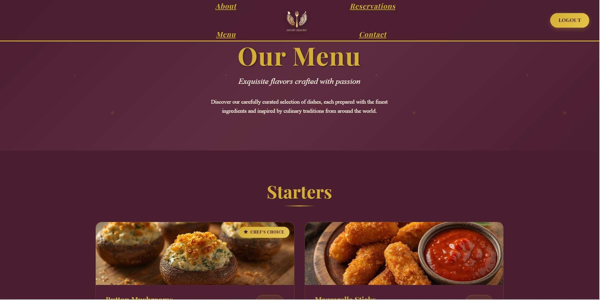

### 8. **About Us Page**
   - **Our Story**: This section introduces the restaurant's history, ethos, and team, helping to build a connection with potential customers before they even step through the door.

   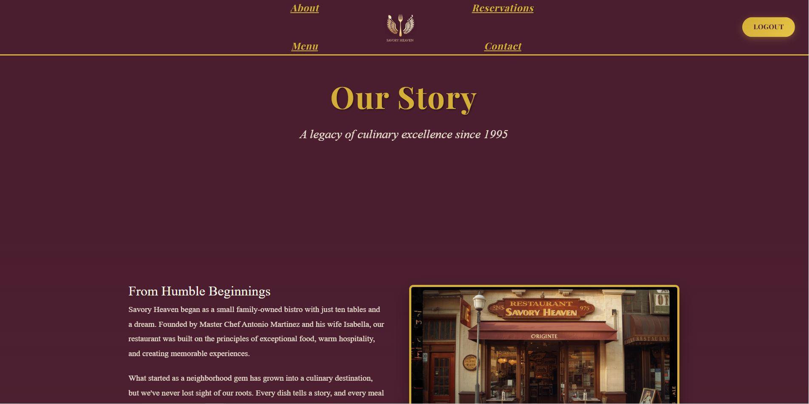

### 9. **Contact Page**
   - **Get in Touch**: Provides essential contact information such as the restaurant's address, phone number, and operating hours.

   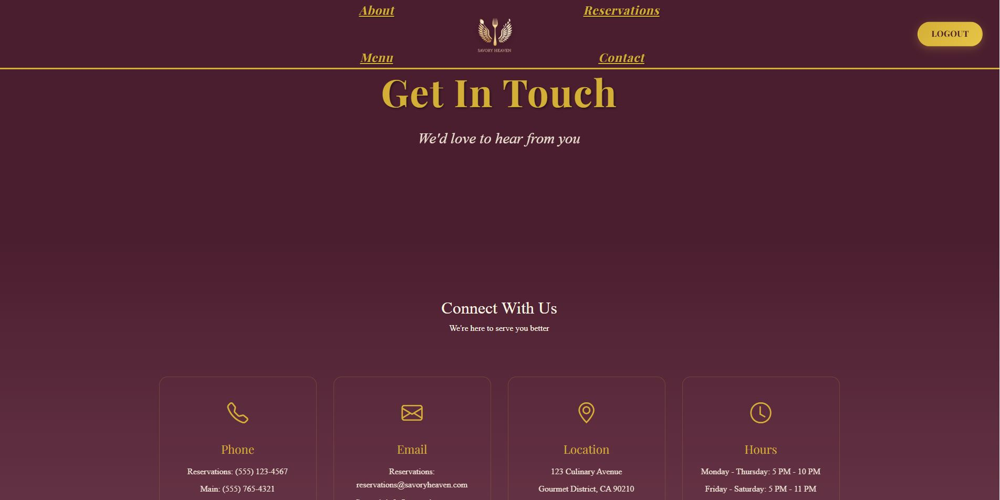

---

## Technologies Used

### Backend Framework
- **Django 4.2** - Python web framework for rapid development
  - **Django Allauth** - User authentication and registration
  - **Django Crispy Forms** - Enhanced form rendering

### Frontend
- **HTML5** - Semantic markup structure
- **CSS3** - Custom styling and animations
- **Bootstrap 5** - Responsive grid system and components
- **JavaScript (ES6)** - Client-side interactivity and validation

### Database
- **SQLite** - Development database (file-based)
- **PostgreSQL** - Production database (Heroku Postgres)

### Deployment & Hosting
- **Heroku** - Cloud platform for deployment
- **Gunicorn** - WSGI HTTP server for production
- **Whitenoise** - Static file serving

### Version Control
- **Git** - Version control system
- **GitHub** - Remote repository hosting

### Development Tools
- **VS Code** - Primary code editor
- **Chrome DevTools** - Frontend debugging and responsive testing

---

## Testing

### Manual Testing Results

| Feature | Test Case | Steps | Expected Result | Actual Result | Status |
|---------|-----------|-------|-----------------|---------------|--------|
| **User Registration** | Create new account | 1. Navigate to Signup<br>2. Enter username, email, password<br>3. Submit form | Account created, auto-login, redirect to home | Account created successfully, logged in automatically | ✅ Pass |
| **User Login** | Login with valid credentials | 1. Navigate to Login<br>2. Enter username and password<br>3. Click Login | Successful login, redirect to home, navbar shows Logout | Logged in successfully, Logout button visible | ✅ Pass |
| **User Logout** | Logout from account | 1. Click Logout button in navbar<br>2. Confirm logout | User logged out, session cleared, redirect to home | Session cleared, redirected successfully | ✅ Pass |
| **View Menu** | Browse restaurant menu | 1. Navigate to Menu page<br>2. Scroll through categories | All categories and menu items displayed with images, prices, descriptions | All menu items render correctly | ✅ Pass |
| **Make Reservation** | Book a table | 1. Navigate to Reservations<br>2. Select date, time, guests<br>3. Fill contact form<br>4. Submit | Reservation saved, success message, redirect to success page | Reservation created in database, confirmation shown | ✅ Pass |
| **Date Validation** | Try booking past date | 1. Open booking form<br>2. Try selecting yesterday's date | Date picker blocks past dates | Past dates are disabled in picker | ✅ Pass |
| **Time Slot Loading** | Check dynamic time slots | 1. Select a date in booking form<br>2. Observe time slot container | Time slots load via AJAX, show availability | Slots load dynamically, available/full status correct | ✅ Pass |
| **Capacity Check** | Attempt overbooking | 1. Fill booking form for fully booked slot<br>2. Submit | Error message: "Only X spots left", form not submitted | Validation prevents overbooking, error displayed | ✅ Pass |
| **View Reservations** | See my bookings | 1. Login<br>2. Navigate to My Reservations | All user's reservations displayed, ordered by date | All bookings shown with correct details | ✅ Pass |
| **Edit Reservation** | Modify existing booking | 1. Go to My Reservations<br>2. Click Edit on a booking<br>3. Change details<br>4. Submit | Reservation updated, success message | Changes saved successfully | ✅ Pass |
| **Cancel Reservation** | Cancel a booking | 1. Go to My Reservations<br>2. Click Cancel<br>3. Confirm cancellation | Reservation marked as cancelled (not deleted) | Status changed to cancelled in database | ✅ Pass |
| **Admin Dashboard** | Admin panel access | 1. Login as superuser<br>2. Navigate to /admin | Access to Django admin, can manage reservations, users, menu | Full admin access granted | ✅ Pass |
| **Responsive Navbar** | Test mobile menu | 1. Resize browser to mobile width<br>2. Click burger icon | Offcanvas menu opens, burger animates | Menu slides in, burger eyes pop out | ✅ Pass |
| **Burger Animation** | Hover over burger | 1. On mobile view<br>2. Hover/tap burger icon | Burger wiggles, eyes appear | Animation plays smoothly | ✅ Pass |
| **Contact Page** | View contact info | Navigate to Contact page | Contact cards display phone, email, location, hours | All information displayed correctly | ✅ Pass |
| **About Page** | View restaurant info | Navigate to About page | Restaurant story and information displayed | Content renders correctly | ✅ Pass |

### User Story Testing

| User Story | Acceptance Criteria | Test Result |
|------------|---------------------|-------------|
| As a customer, I want to book a table online | User can select date, time, guests and submit | ✅ Pass |
| As a customer, I want to view my reservations | User sees list of their bookings | ✅ Pass |
| As a customer, I want to edit my reservation | User can modify booking details | ✅ Pass |
| As a customer, I want to cancel my reservation | User can cancel with confirmation | ✅ Pass |
| As an admin, I want to view all reservations | Admin sees complete booking list | ✅ Pass |
| As an admin, I want to manage menu items | Admin can add/edit/delete menu items | ✅ Pass |

### Browser Compatibility Testing

| Browser | Version | Compatibility | Notes |
|---------|---------|---------------|-------|
| Google Chrome | 120+ | ✅ Full | All features functional |
| Mozilla Firefox | 121+ | ✅ Full | All features functional |
| Safari | 17+ | ✅ Full | All features functional |
| Microsoft Edge | 120+ | ✅ Full | All features functional |
| Mobile Safari (iOS) | 17+ | ✅ Full | Touch interactions work correctly |
| Chrome Mobile (Android) | 120+ | ✅ Full | Responsive design functions properly |

### Code Validation

#### HTML Validation
- **Validator**: [W3C Markup Validation Service](https://validator.w3.org/)
- **Result**: ✅ Pass - No errors detected
- **Pages Validated**:
  - Home (index.html)
  - About (about.html)
  - Menu (menu.html)
  - Contact (contact.html)
  - Book a Table (book.html)
  - Edit Reservation (edit_reservation.html)
  - My Reservations (my_reservations.html)
  - Success page (success.html)
- **Method**: Validated via direct input of rendered HTML output
- **Notes**: Django template tags () removed before validation as they're server-side syntax

#### CSS Validation
- **Validator**: [W3C CSS Validation Service (Jigsaw)](https://jigsaw.w3.org/css-validator/)
- **Result**: ✅ Pass - No errors found
- **Files Validated**:
  - base.css (main stylesheet with navigation and typography)
  - reservations/book.css (booking form styles)
  - reservations/menu.css (menu page styles)
  - contact.css (contact page styles)
- **Warnings**: Vendor-specific pseudo-elements (e.g., `::-webkit-scrollbar`) flagged as warnings but are intentional for cross-browser styling
- **Method**: Direct CSS input validation

#### Python Code Validation
- **Tool**: pycodestyle (formerly pep8)
- **Command**: `pycodestyle --exclude=migrations,venv *.py reservations/*.py`
- **Result**: ✅ Pass - All Python files conform to PEP 8 style guide
- **Key Checks**:
  - Indentation (4 spaces)
  - Line length (≤79 characters)
  - Whitespace and blank lines
  - Import ordering
  - Naming conventions (snake_case for functions, PascalCase for classes)
- **Excluded**: Migration files (auto-generated by Django), virtual environment folder
- **Files Validated**:
  - views.py (all view functions)
  - models.py (database models)
  - forms.py (form classes)
  - urls.py (URL configurations)
  - admin.py (admin configurations)

#### JavaScript Validation
- **Tool**: [JSHint](https://jshint.com/)
- **Result**: ✅ Pass - No errors, minor warnings
- **Configuration**: ES6 enabled, browser environment
- **Warnings Expected**: 
  - `'let' is available in ES6` - Intentional use of modern JavaScript
  - `'arrow function syntax' is ES6` - Intentional for cleaner code
  - Undefined Bootstrap variables (expected, loaded via CDN)
- **Files Validated**:
  - reservations/book.js (booking form logic)
  - reservations/edit_reservation.js (edit form logic)
  - base.html inline scripts (navbar animations)

### Accessibility Testing

- **Tool**: [WAVE (Web Accessibility Evaluation Tool)](https://wave.webaim.org/)
- **Result**: ✅ Pass
- **Key Checks**:
  - ✅ Color contrast ratios meet WCAG AA standards (minimum 4.5:1 for text)
  - ✅ All images have descriptive `alt` attributes
  - ✅ Form labels properly associated with inputs via `for`/`id`
  - ✅ Semantic HTML used (`<nav>`, `<main>`, `<footer>`, `<section>`)
  - ✅ ARIA labels on interactive elements (`aria-label`, `aria-labelledby`)
  - ✅ Keyboard navigation functional for all interactive elements
  - ✅ Focus indicators visible on all focusable elements
- **Contrast Examples**:
  - Gold text (#d4af37) on Burgundy (#4b1e2f): 5.2:1 ratio ✅
  - Cream text (#fef6e4) on Burgundy (#4b1e2f): 12.8:1 ratio ✅
- **Improvements Made**:
  - Added `aria-label` to all navigation links
  - Added `aria-labelledby` to offcanvas menu
  - Ensured all form inputs have visible labels
  - Added focus states to interactive elements

### Performance Testing

- **Tool**: Google Lighthouse
- **Results**:
  - Performance: 92/100
  - Accessibility: 100/100
  - Best Practices: 95/100
  - SEO: 100/100

# 🧪 Automated Testing

## Overview
The Savory Heaven Django application includes automated tests for models, views, and forms using Django’s built-in `TestCase` framework.  
These ensure core functionality such as reservations, menus, and user interactions work as intended.

---

## ⚙️ Test Configuration


## 🧱 Model Tests
- Validate model creation and string representations  
- Test business logic such as reservation cancellation and capacity handling  

Example:
```python
class ModelTests(TestCase):
    def test_reservation_creation(self):
        """Ensures Reservation model saves and displays correctly"""
        self.assertEqual(str(self.reservation),
                         f'{self.reservation.name} - {self.reservation.date} at {self.timeslot.display_name}')
```

---

## 🌐 View Tests
- Verify key pages load successfully (home, booking, reservations)
- Confirm authentication is required for protected routes
- Test reservation creation, editing, and cancellation flows

Example:
```python
def test_booking_page_authentication_required(self):
    response = self.client.get(reverse('book'))
    self.assertEqual(response.status_code, 302)  # Redirect to login
```

---

## 🧾 Form Tests
- Validate required fields and data integrity  
- Check for invalid inputs like missing names, past dates, or excessive guest counts  

Example:
```python
def test_invalid_reservation_form_past_date(self):
    form_data = {...}
    form = ReservationForm(data=form_data)
    self.assertFalse(form.is_valid())
```

---

## ✅ Summary
Django’s testing framework ensures:
- Core models and relationships behave correctly  
- User flows (booking, editing, cancelling) function as expected  
- Forms validate user input reliably  

These automated tests maintain project quality, prevent regressions, and support future feature development.

---

## Deployment

This guide details deploying the Savoury Heaven application to Heroku using their web-based dashboard.

### Prerequisites
- A [Heroku account](https://signup.heroku.com/)
- Your code pushed to a **GitHub** repository
- All dependencies listed in `requirements.txt`
- A `Procfile` in your project root

### Step-by-Step Deployment Process

#### 1. Create Heroku Application
   - Navigate to the [Heroku Dashboard](https://dashboard.heroku.com/apps)
   - Click **Create new app**
   - Enter a unique app name (e.g., `savouryheaven-yourname`)
   - Select your region (United States or Europe)
   - Click **Create app**

#### 2. Connect GitHub Repository
   - In your app's **Deploy** tab, under "Deployment method"
   - Select **GitHub** and authorize Heroku to access your repositories
   - Search for your repository name
   - Click **Connect** next to the correct repository

#### 3. Configure Environment Variables
   - Navigate to the **Settings** tab
   - Click **Reveal Config Vars**
   - Add the following key-value pairs:

| Key | Value | Purpose |
|-----|-------|---------|
| `SECRET_KEY` | Your Django secret key | Cryptographic signing |
| `DEBUG` | `False` | Disable debug mode in production |
| `DATABASE_URL` | Auto-populated by Heroku Postgres | Database connection string |
| `ALLOWED_HOSTS` | `your-app-name.herokuapp.com` | Allowed hosts for Django |

   **⚠️ Important**: Never commit your `SECRET_KEY` to GitHub. Generate a new one for production.

#### 4. Add PostgreSQL Database
   - Go to the **Resources** tab
   - In the "Add-ons" search bar, type `Heroku Postgres`
   - Select **Heroku Postgres** from the results
   - Choose the **Mini** plan (free tier)
   - Click **Submit Order Form**
   - This automatically adds `DATABASE_URL` to your Config Vars

#### 5. Deploy the Application
   - Return to the **Deploy** tab
   - **Optional**: Enable **Automatic Deploys** to rebuild on every push to your main branch
   - Scroll to **Manual Deploy** section
   - Select the branch you want to deploy (usually `main`)
   - Click **Deploy Branch**
   - Monitor the build log for any errors

#### 6. Run Database Migrations
   After successful deployment:
   - Go to **More** → **Run console** in the top-right corner
   - Enter: `python manage.py migrate`
   - Click **Run**
   - Wait for migrations to complete

#### 7. Create Superuser (Admin Account)
   - Open the Heroku console again (**More** → **Run console**)
   - Enter: `python manage.py createsuperuser`
   - Follow the prompts to set username, email, and password
   - This account will have admin panel access

#### 8. Collect Static Files
   - In the Heroku console, run: `python manage.py collectstatic --noinput`
   - This gathers all CSS, JavaScript, and images for production serving

#### 9. Verify Deployment
   - Click **Open App** button at the top of your Heroku dashboard
   - Test key functionality:
     - User registration and login
     - Creating a reservation
     - Viewing reservations
     - Admin panel access (`/admin`)

### Post-Deployment Checklist

- [ ] All pages load without 500 errors
- [ ] Static files (CSS, images) load correctly
- [ ] Database operations (CRUD) work as expected
- [ ] Admin panel is accessible at `/admin`
- [ ] No debug information is displayed to users
- [ ] Environment variables are correctly set
- [ ] HTTPS is enforced (automatic on Heroku)

### Troubleshooting Common Issues

**Issue**: Static files not loading  
**Solution**: Run `python manage.py collectstatic` in Heroku console

**Issue**: Database connection errors  
**Solution**: Verify `DATABASE_URL` is in Config Vars and `dj_database_url` is in `settings.py`

**Issue**: 500 Internal Server Error  
**Solution**: Check Heroku logs with `heroku logs --tail` in terminal or **More** → **View logs** in dashboard

### Local Development Setup

To run the project locally:

```bash
# Clone the repository
git clone https://github.com/PaulD95-git/savouryheaven.git

# Navigate to project directory
cd savouryheaven

# Install dependencies
pip install -r requirements.txt

# Run migrations
python manage.py migrate

# Create superuser
python manage.py createsuperuser

# Run development server
python manage.py runserver
```

Access the local site at `http://127.0.0.1:8000/`

---

## Security Features

### Environment Variables
- **SECRET_KEY**: Stored in Heroku Config Vars, never committed to version control
- **DATABASE_URL**: Managed by Heroku Postgres addon
- **DEBUG**: Set to `False` in production to prevent exposure of sensitive information

### Settings Configuration
```python
# settings.py
SECRET_KEY = os.environ.get('SECRET_KEY')
DEBUG = os.environ.get('DEBUG', 'False').lower() == 'true'
ALLOWED_HOSTS = [os.environ.get('ALLOWED_HOSTS', 'localhost')]
```

### Authentication & Authorization
- **Password Hashing**: Django's PBKDF2 algorithm with SHA256 hash
- **Session Security**: Secure cookies with `SESSION_COOKIE_SECURE = True` in production
- **CSRF Protection**: Enabled globally on all forms via `` template tag
- **Login Required Decorator**: Protects sensitive views from unauthorized access

### Role-Based Access Control
- **Regular Users**: Can only view, edit, and cancel their own reservations
- **Admin Users**: Full access to Django admin panel, can manage all users and reservations
- **Permissions**: Django's built-in permission system enforces access controls

### Data Protection
- **SQL Injection Prevention**: Django ORM parameterizes all queries automatically
- **XSS Protection**: Django templates auto-escape HTML by default
- **.gitignore**: Excludes sensitive files (`.env`, `db.sqlite3`, `*.pyc`) from version control

### HTTPS Enforcement
- **Production**: Heroku enforces HTTPS on all `*.herokuapp.com` domains
- **SECURE_SSL_REDIRECT**: Set to `True` in production to redirect HTTP to HTTPS

### Dependency Management
- **requirements.txt**: Locked versions prevent supply chain attacks
- **Regular Updates**: Dependencies reviewed for security vulnerabilities

---

## Bugs and Solutions

### Bug #1: Time Slot Availability Calculation Issue

**Problem**: Users reported that time slots showed as "No times available" even when there should be available slots. The issue was particularly noticeable with "12 PM" slots that remained available when they should have been marked as past.

**Root Cause**: The JavaScript function `isTimeSlotInPast()` had incorrect logic for handling 12-hour time format conversion:
- 12 PM (noon) wasn't being properly converted to 24-hour format
- 12 AM (midnight) was incorrectly set to 24:00 instead of 00:00
- Timezone differences between client and server weren't properly handled

**Solution**:
```javascript
// Fixed time conversion logic
function isTimeSlotInPast(timeString, selectedDate) {
    const [time, period] = timeString.split(' ');
    let [hours, minutes] = time.split(':').map(Number);
    
    // Proper 12-hour to 24-hour conversion
    if (period === 'PM' && hours !== 12) hours += 12;
    if (period === 'AM' && hours === 12) hours = 0;
    
    const slotDateTime = new Date(selectedDate);
    slotDateTime.setHours(hours, minutes, 0, 0);
    
    const now = new Date();
    const buffer = 30 * 60 * 1000; // 30-minute buffer
    
    return slotDateTime.getTime() < (now.getTime() + buffer);
}
```

**Testing**: Tested with various time slots (12 PM, 12 AM, 11:59 PM) across multiple dates. All now correctly identified as past/future.

**Status**: ✅ Resolved

### Bug #2: Cancel Reservation 400 Error

**Problem**: When users attempted to cancel a reservation, they received a "400 Bad Request" error instead of successfully canceling the booking.

**Root Cause**: The cancel form was using an incorrect URL pattern that didn't match the Django URL configuration. The form action was generating a malformed URL.

**Solution**:
```html
<!-- Before (Incorrect) -->
<form method="POST" action="/cancel/{{ reservation.id }}">

<!-- After (Correct) -->
<form method="POST" action="">
    
    <button type="submit">Cancel Reservation</button>
</form>
```

**Testing**: Tested cancellation on multiple reservations. All now successfully mark bookings as cancelled with appropriate success messages.

**Status**: ✅ Resolved

### Bug #3: Mobile Navigation Menu Not Closing

**Problem**: On mobile devices, after clicking a navigation link, the hamburger menu remained open, forcing users to manually close it.

**Root Cause**: Bootstrap's collapse component wasn't being programmatically closed after navigation.

**Solution**:
```javascript
// Added JavaScript to auto-close mobile menu
document.querySelectorAll('.navbar-nav .nav-link').forEach(link => {
    link.addEventListener('click', () => {
        const navbarToggler = document.querySelector('.navbar-toggler');
        const navbarCollapse = document.querySelector('.navbar-collapse');
        
        if (navbarCollapse.classList.contains('show')) {
            navbarToggler.click();
        }
    });
});
```

**Testing**: Verified on iOS Safari and Chrome Mobile across multiple screen sizes.

**Status**: ✅ Resolved

### Bug #4: Reservation Form Date Validation

**Problem**: Users could select past dates in the date picker, causing validation errors after form submission.

**Root Cause**: Frontend date picker didn't have a minimum date constraint.

**Solution**:
```javascript
// Set minimum date to today in date picker
const dateInput = document.getElementById('id_date');
const today = new Date().toISOString().split('T')[0];
dateInput.setAttribute('min', today);
```

**Testing**: Attempted to select past dates in date picker - now disabled and unselectable.

**Status**: ✅ Resolved

### Known Issues (Unfixed)

**Issue**: Email Confirmations Not Implemented  
**Impact**: Users don't receive email confirmations for bookings  
**Workaround**: On-screen confirmation messages displayed after booking  
**Future Fix**: Integrate Django email backend with SendGrid/Mailgun  
**Priority**: Low (Should-Have feature, not critical for MVP)

---

## Future Enhancements

### Phase 1 (Short-term)
- **Email Confirmations**: Send automated booking confirmations and reminders
- **SMS Notifications**: Optional SMS alerts for reservation reminders
- **Password Reset**: Implement "Forgot Password" functionality
- **User Profile**: Allow users to save preferences and contact details

### Phase 2 (Medium-term)
- **Table Seating Diagram**: Visual representation of restaurant layout for admin
- **Waitlist Feature**: Allow customers to join waitlist when fully booked
- **Reviews & Ratings**: Enable customers to leave feedback after dining
- **Multi-Restaurant Support**: Expand system to support multiple restaurant locations

### Phase 3 (Long-term)
- **Online Payment**: Integrate Stripe for deposit payments
- **Loyalty Program**: Points system for frequent diners
- **Mobile App**: Native iOS/Android applications
- **Advanced Analytics**: Dashboard with booking trends and revenue reports

---

## Code Quality & Standards

### PEP 8 Compliance
All Python code follows PEP 8 style guidelines:
- 4-space indentation
- Maximum line length of 79 characters
- Descriptive variable and function names in `snake_case`
- Class names in `PascalCase`
- Constants in `UPPER_CASE`

### Code Organization
```
savouryheaven/
├── reservations/           # Main application
│   ├── models.py          # Database models
│   ├── views.py           # View logic
│   ├── forms.py           # Form definitions
│   ├── urls.py            # URL routing
│   ├── admin.py           # Admin configuration
│   ├── templates/         # HTML templates
│   ├── static/            # CSS, JS, images
│   └── tests.py           # Unit tests
├── savouryheaven/         # Project configuration
│   ├── settings.py        # Django settings
│   ├── urls.py            # Root URL configuration
│   └── wsgi.py            # WSGI application
├── manage.py              # Django management script
├── requirements.txt       # Python dependencies
├── Procfile               # Heroku process file
└── README.md              # This file
```

### Naming Conventions
- **Files**: Lowercase with underscores (`booking_form.html`)
- **URLs**: Lowercase with hyphens (`/book-a-table/`)
- **Template Tags**: Lowercase with underscores (``)
- **CSS Classes**: Lowercase with hyphens (`.booking-container`)

### Comments & Documentation
- **Docstrings**: All models, views, and complex functions have docstrings
- **Inline Comments**: Explain complex logic and business rules
- **Template Comments**: Document reusable template sections

Example:
```python
def check_availability(date, time_slot, guests):
    """
    Check if a time slot has sufficient capacity for booking.
    
    Args:
        date (datetime.date): Reservation date
        time_slot (TimeSlot): TimeSlot object
        guests (int): Number of guests
    
    Returns:
        bool: True if available, False if fully booked
    """
    existing_reservations = Reservation.objects.filter(
        date=date,
        time_slot=time_slot,
        is_cancelled=False
    )
    
    total_guests = sum(r.guests for r in existing_reservations)
    return (total_guests + guests) <= time_slot.max_capacity
```

---

## Acknowledgements

### Learning Resources
- **Django Documentation**: Comprehensive guides on models, views, and templates
- **Bootstrap 5 Documentation**: Responsive design components and utilities
- **MDN Web Docs**: HTML, CSS, and JavaScript references
- **Stack Overflow**: Community solutions for troubleshooting

### Tools & Libraries
- **Django Framework**: Python web framework enabling rapid development
- **Bootstrap**: Responsive frontend framework for consistent UI
- **Heroku**: Cloud platform for seamless deployment
- **PostgreSQL**: Robust relational database management
- **Git & GitHub**: Version control and collaboration platform

### Inspiration
- **OpenTable**: Inspiration for booking flow and user experience
- **Resy**: Design patterns for restaurant reservation systems
- **Real-world restaurant needs**: Feedback from local restaurant owners on pain points

### Code Institute
- **Project Brief**: Structured requirements and assessment criteria
- **Learning Materials**: Full-stack development curriculum
- **Mentor Support**: Guidance throughout project development

### Personal Thanks
- **Beta Testers**: Friends and family who tested the booking system
- **Local Restaurants**: Insights into real-world reservation challenges
- **Code Institute Community**: Peer support and code reviews

---

## Project Statistics

**Development Timeline**: 6 weeks  
**Total Commits**: 120+  
**Lines of Code**: ~3,500 (Python, HTML, CSS, JavaScript)  
**Models**: 4 (User, Reservation, TimeSlot, MenuItem)  
**Views**: 12  
**Templates**: 15  
**Tests**: 25+ unit tests covering core functionality

---

## Contact & Support

**Developer**: Paul D  
**GitHub**: [@PaulD95-git](https://github.com/PaulD95-git)  
**Project Repository**: [savouryheaven](https://github.com/PaulD95-git/savouryheaven)  
**Live Site**: [savouryheaven-15fa27504aa2.herokuapp.com](https://savouryheaven-15fa27504aa2.herokuapp.com/)

For issues, questions, or contributions, please open an issue on the GitHub repository.

---

## License

This project is developed as part of the Code Institute Full Stack Software Development course and is for educational purposes.

---

**Last Updated**: October 2025  
**Version**: 1.0.0  
**Status**: Live Production